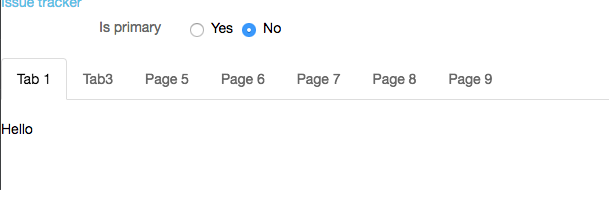
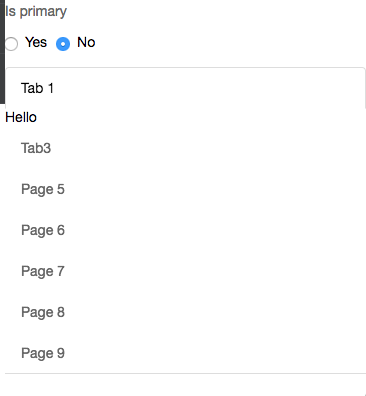
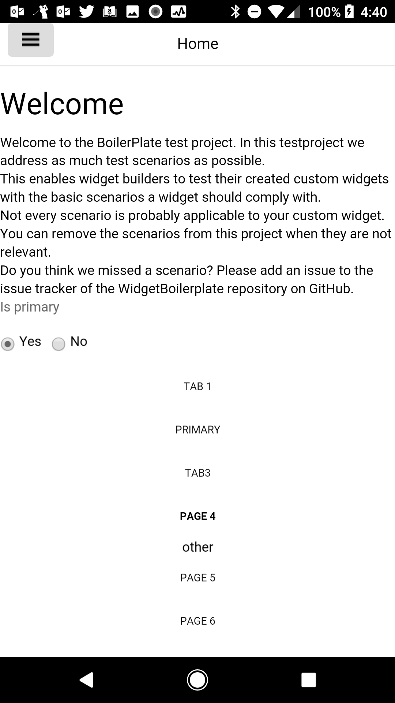
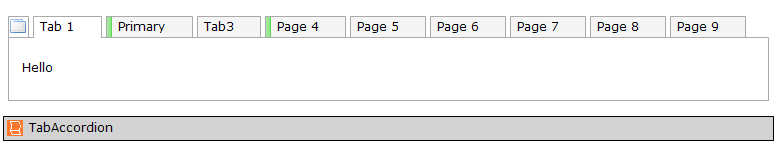
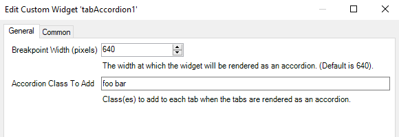

# Tab Accordion 📱

Tabs that re-organize themselves into a stacked-accordion at a certain breakpoint.

### Installation

1. Install the widget in your project
2. Include the **Tab Accordion** widget on a page as a sibling of a tab container you'd like to display as full-width responsive
   
3. Configure the widget:
   

+ `breakpoint` : Screen width (in pixels) to split between regular tabs and the stacked accordion
+ `Tabs Class (To Add)` : Add a class to the bar of tab headings

### Typical usage scenario

- When you have a lot of tabs and want to re-organize them in a single column

### Known Limitations

- none

###### Based on the Mendix Widget Boilerplate

See [AppStoreWidgetBoilerplate](https://github.com/mendix/AppStoreWidgetBoilerplate/) for an example
